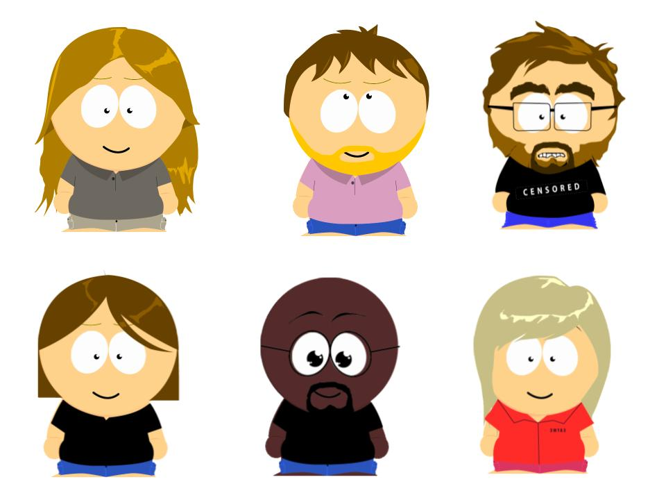

[](https://travis-ci.org/lucianmot/acebook-off-the-rails)

# AceBook

This project is a Ruby on Rails social message posting application. It is one of the Makers Academy engineering projects.

# Live Demo

If you would like to view this project click the following link:
https://acebook-off-the-rails.herokuapp.com/

## Meet the Team



## Usage

To be described when we have a working version.

## API

To be described when we have a working API, if that happens.

## How to Install

First, clone this repository. Then:

```bash
> bundle install
> bin/rails db:create
> bin/rails db:migrate

> bundle exec rspec # Run the tests to ensure it works
> bin/rails server # Start the server at localhost:3000
```

## How to Test

Navigate to the root of the project then run the tests from the command line

```console
admin$ rspec
```

## Project Kanban Board

https://trello.com/b/voEAOwPH/off-the-rails-taskboard

## Technology Used

* Ruby on Rails - Web Application Framework
* Devise - User Authentication

## License

GNU General Public License v2.0
